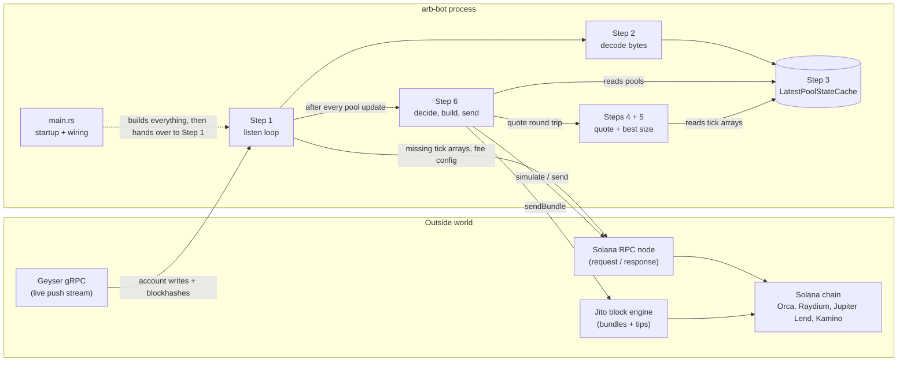
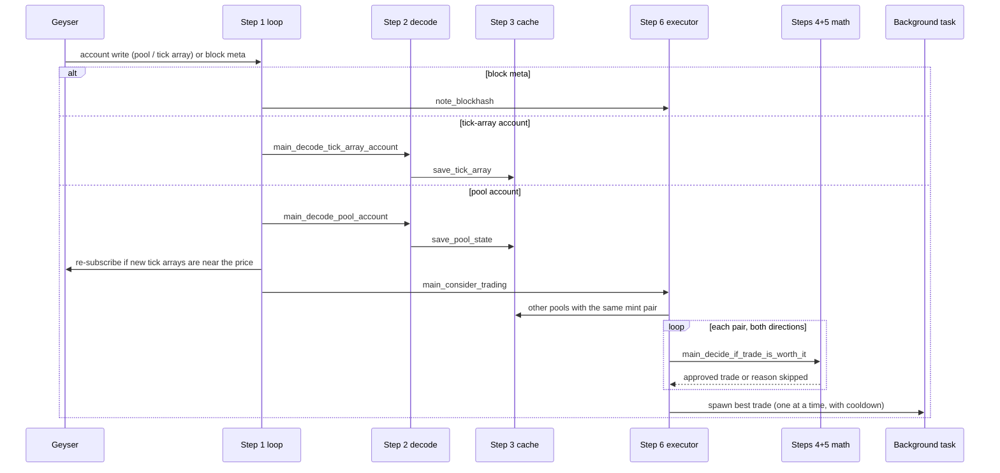

# arb-bot architecture

A Solana bot that watches SOL/USDC pools on Orca Whirlpool and Raydium CLMM.
When one pool's price drifts away from another's, it works out whether a round
trip (sell SOL on the expensive pool, buy it back on the cheap one) pays after
every cost. If it does, it builds, signs, and (only when allowed) sends the trade.

Out of scope here: `dashboard_events/`, `print_logs/`, `tests/`.

## 1. The big picture

The bot runs one hot loop. Each Geyser message updates the in-memory cache, and
each pool update asks Step 6 whether to trade. Everything in between is local
math on cached state. The network is touched only to fill gaps (RPC) and to send
the trade (RPC or Jito).

## 2. Layers

| Layer | Folder / file | Owns |
|---|---|---|
| Entry and config | `main.rs`, `bot_settings.rs` | Startup order, every env knob, safe defaults |
| Network links | `solana_connections/` | Geyser stream, RPC client, Jito client, blockhash cache |
| Ingest | `step_1_listen_to_account_updates/` | The forever loop and the two update handlers |
| Parse | `step_2_decode_account_bytes/` | Raw account bytes into typed structs, one decoder per DEX |
| State | `step_3_store_latest_pool_state/` | Shared types, watched pool list, the cache |
| Math | `step_4_quote_swaps/`, `step_5_find_best_arbitrage_size/` | Exact DEX swap math, round-trip quote, profit-maximizing size |
| Execution | `step_6_build_and_send_transactions/` | Cost check, instructions, signing, simulate/send, confirmation |

Dependencies only point "down" this table, with one exception: Step 6 calls
back into Steps 4 and 5 to quote the trade it is deciding on.

## 3. Startup (`main.rs`)

1. Install the TLS crypto provider and load `.env`.
2. `create-lookup-table` subcommand: build an address lookup table and exit.
3. `WatchedPools::sol_usdc_pools()`: six SOL/USDC pools (Orca and Raydium, several fee tiers).
4. `LatestPoolStateCache::new()` and `SolanaRpcClient::from_env()`.
5. `BotSettingsFromEnvironment::from_env()`, then `TradeDecisionRules::from_settings()`.
6. `ArbitrageTradeExecutor::prepare()`: loads the wallet, flash-loan accounts,
   lookup tables, and Jito tip accounts. It returns `None` when there is no
   `WALLET_KEYPAIR_PATH`, and the bot then only watches.
7. `connect_to_geyser_grpc()`: subscribes to the pool accounts plus `blocks_meta`
   and seeds the blockhash cache.
8. `main_process_account_updates_forever()`: never returns.

## 4. The hot path, one message at a time

### Step 1: Listen
`account_update_loop.rs` sorts every message into one of three kinds: blockhash,
pool account, or tick-array account.

- **Pool update** (`handle_pool_account_update.rs`): decode, apply the Raydium fee
  tier, and save to the cache. Work out which tick arrays surround the new price
  and subscribe to any new ones. Fetch those once over RPC, because Geyser only
  pushes future writes. Then call `main_consider_trading`.
- **Tick-array update**: decode and save.

### Step 2: Decode
`decoder_for_each_dex.rs` dispatches on `DexProgram` to the Orca or Raydium
decoder. Each checks the Anchor discriminator and reads fixed little-endian
offsets into `ConcentratedLiquidityPoolState` / `TickArrayAccountWithInitializedTicks`.

### Step 3: State
`LatestPoolStateCache` is a set of `RwLock<HashMap>`s: pools by address, pools
grouped by mint pair, watched tick arrays, their decoded contents, and Raydium
fee rates. It also keeps two freshness clocks: the newest slot seen, and the
time since the last stream message.

### Steps 4 and 5: Math
- `main_quote_swap_exact_input` runs the DEX's own integer swap math
  (the Orca SDK for Whirlpool, a port of the Raydium math for CLMM).
- `main_quote_two_pool_round_trip` chains two swaps: SOL to USDC on the sell
  pool, then USDC back to SOL on the buy pool.
- `main_find_input_amount_that_maximizes_profit` walks both pools' tick books
  together and uses closed-form concentrated-liquidity formulas to find where
  the price gap after fees closes.
- `main_quote_most_profitable_two_pool_round_trip` = best size, then an exact quote.

### Step 6: Decide, build, send
1. **Decide** (`decide_if_trade_is_worth_it.rs`)
   - Reject stale data (`MAX_STATE_AGE_SLOTS`, `MAX_STREAM_SILENCE_MS`).
   - Get the best size and cap it at `MAX_TRADE_INPUT_LAMPORTS`.
   - Reject partial fills.
   - Apply slippage to leg 1.
   - Subtract the signature fee, the priority fee or Jito tip, and the flash-loan
     fee, and require `MIN_PROFIT_LAMPORTS`.
2. **Gate** (`arbitrage_trade_executor.rs`): keep the best approved direction,
   then run it on a `tokio::spawn` task. An `AtomicBool` allows one trade in
   flight, and a cooldown applies after each submit.
3. **Build** (`assemble_arbitrage_transaction.rs`), in this order:
   - compute budget
   - create the token accounts (ATAs)
   - wrap SOL *or* flash borrow
   - swap leg 1
   - swap leg 2
   - flash repay (flash-loan mode only)
   - close wSOL
   - Jito tip

   It builds two versions: a Jito one (tip, no priority fee) and an RPC one
   (priority fee, no tip). Each is compiled to a v0 message using lookup
   tables and signed.
4. **Send** (`send_and_confirm.rs`): optionally simulate first
   (`RPC_SIMULATION`). Send only if `SEND_TRANSACTIONS=true`. Jito is tried
   first, and RPC is the fallback. Then poll the signature status and report
   the change in SOL balance.

**Safety net:** leg 2's minimum output is `start amount + all costs + minimum
profit`. If prices move before the trade lands, the chain reverts the whole
transaction, and a reverting Jito bundle is never included.

## 5. Funding modes

| `FUNDING_MODE` | Leg 1 input comes from | Extra instructions |
|---|---|---|
| `wallet` (default) | The bot's own SOL, wrapped into wSOL | `wrap_sol`, then `close_token_account` |
| `flash_loan` | Borrowed wSOL from Jupiter Lend or Kamino | `borrow` before leg 1, `repay` after leg 2 (needs a lookup table to fit) |

## 6. Safety switches

| Setting | Default | Effect |
|---|---|---|
| `WALLET_KEYPAIR_PATH` | unset | Unset means watch and quote only; no executor |
| `SEND_TRANSACTIONS` | `false` | Build and sign, never send |
| `RPC_SIMULATION` | `false` | Dry-run on RPC before sending |
| `MAX_TRADE_INPUT_LAMPORTS` | 1 SOL | Hard cap on trade size |
| `MIN_PROFIT_LAMPORTS` | 10,000 | Profit that must remain after all costs |

## 7. Concurrency model

- One Tokio runtime. The listen loop is a single task, so cache writes happen
  in stream order.
- The cache uses `RwLock`: quoting reads in parallel, and each update briefly
  takes the write lock.
- Trades run on spawned tasks, so the listen loop never waits on the network.
  Only one trade runs at a time.
- Blockhashes arrive on the same Geyser stream, so building a transaction
  normally needs no RPC call.
