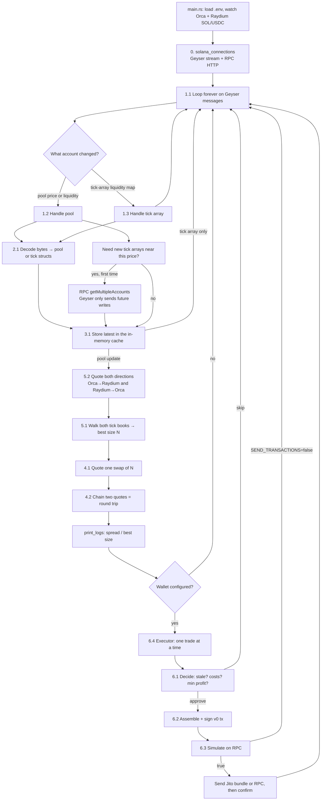

# Pipeline

The numbered folders are a **reading order**. At runtime they nest: every Geyser write goes through listen → decode → store, and only a **pool** update then runs size/quote and maybe trade.

## How to read it

| When | What happens |
|---|---|
| Once | Connect, subscribe to the two pools, maybe load a wallet (`6.4 prepare`) |
| Every Geyser write | `1.1` → decode `2` → cache `3` |
| Tick-array write | Stop after cache. No quote. |
| Pool write | Then size `5` uses quote `4`. That is one job: *given live books, what N and what out?* |
| After that | `6.1` subtracts **network / priority / tip / flash** (DEX fees already in `4`–`5`). Simulate is always on; send only if `SEND_TRANSACTIONS=true` |

`print_logs` is not a step. Helpers under each `functions/` folder are DEX-specific or instruction builders, not extra pipeline stages.

## Folders

| Step | Folder | Sub-steps |
|---|---|---|
| 0 | `src/solana_connections` | Geyser gRPC, RPC HTTP, Jito |
| 1 | `src/step_1_listen_to_account_updates` | 1.1 loop, 1.2 pool, 1.3 tick array |
| 2 | `src/step_2_decode_account_bytes` | 2.1 pick Orca or Raydium decoder |
| 3 | `src/step_3_store_latest_pool_state` | 3.1 in-memory cache |
| 4 | `src/step_4_quote_swaps` | 4.1 one swap, 4.2 round trip |
| 5 | `src/step_5_find_best_arbitrage_size` | 5.1 best size, 5.2 both directions |
| 6 | `src/step_6_build_and_send_transactions` | 6.1 decide, 6.2 assemble, 6.3 simulate/send, 6.4 executor |
